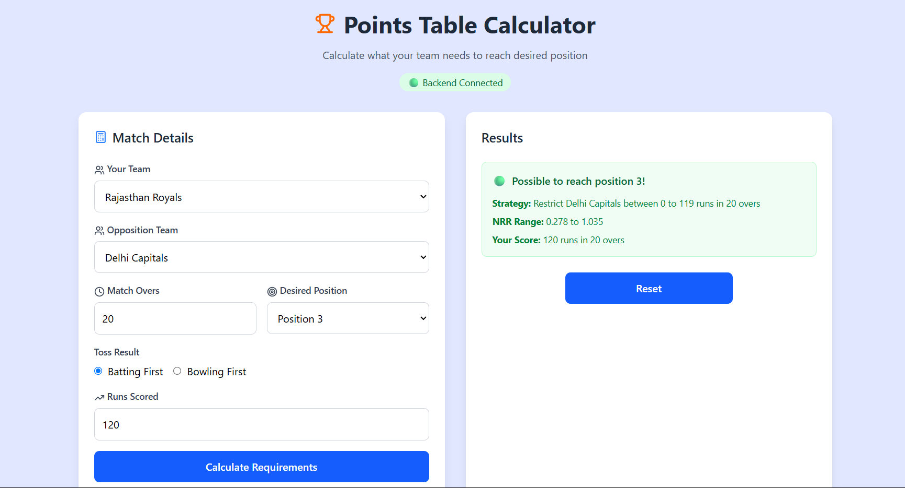

# 🏏 Smart Points Table Calculator

<div align="center">


**A comprehensive tool to calculate what your team needs to reach desired position in points table**

</div>

## 🚀 Installation

### Prerequisites
- Node.js 18+ installed
- npm or yarn package manager

### Quick Start

1. **Clone the repository**
   ```bash
   git clone https://github.com/Dhruil/CricketTool.git
   cd CricketTool
   ```

2. **Install dependencies**
   ```bash

   # Path should be
   ...\CricketTool

   # Install backend dependencies
   npm install

   # Install frontend dependencies
   cd Front-end 
   npm install
   
   # Go to backend
   cd ..
   ```

3. **Start the backend server**
   ```bash
   node server.js
   ```
   Server will start on `http://localhost:3001`

4. **Start the frontend (if using separate React app)**
   ```bash
   # In a new terminal

    # Path should be
   ...\CricketTool 

   # Go to Front-end Folder and start the Front-end
   cd Front-end
   npm run dev
   ```
   Frontend will start on `http://localhost:5173`

5. **Access the application**
   Open your browser and navigate to the frontend URL

--- 

<div align="center">

**Made with ❤️ for cricket fans and developers**


</div>